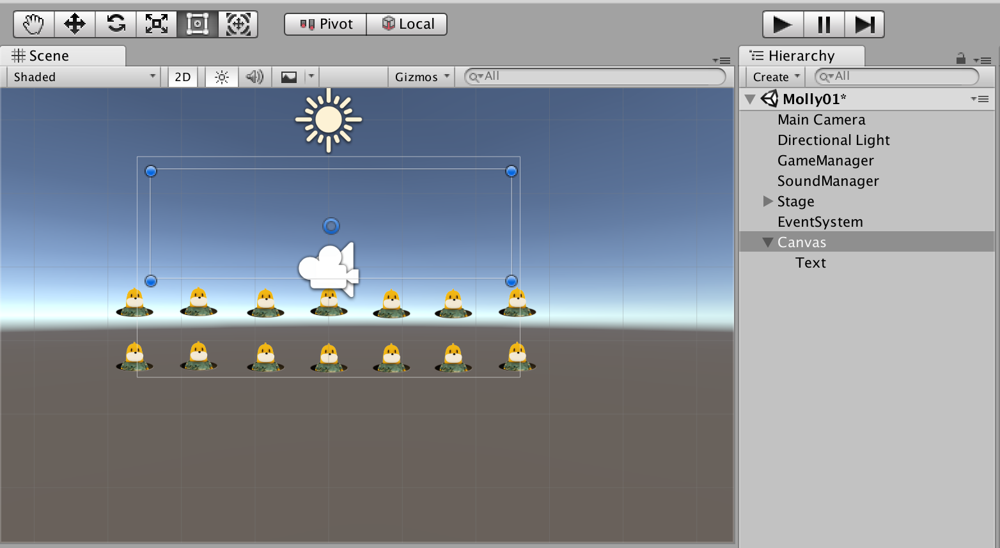

프로젝트 지원 파일 MollyMolly 폴더에 있다.
게임 파일은 MollyMolly/Mole Game 폴더
- [MoleGame]Scripts.unitypackage
- [MoleGame]Sound.unitypackage
- [MoleGame]Texture.unitypackage
- SceneMove.cs


## 착한 두더쥐, 나쁜 두더쥐 구분하기

구멍에 나쁜 두더쥐, 착한 두더쥐를 모두 나오게 해보자.

1. Open 상태로 전환할 때 랜덤 값으로 착한 두더쥐, 나쁜 두더쥐를 선택한다.
2. 각 두더쥐의 애니메이션
3. Catch 상태에서 각 두더쥐 처리를 다르게 하자.

### 두더쥐 추가

```cs
  //나쁜두더쥐
  public Texture[] Open_Images2;
  public Texture[] Idle_Images2;
  public Texture[] Close_Images2;
  public Texture[] Catch_Images2;

  // 두더쥐 종류
  public bool GoodMole;
  
  // PerGood/100 확률, 15% 확률로 착한 두더쥐가 등장.
  public int PerGood = 15;

```

난이도를 조절하려면 perGood 같은 확률 변수를 조정하면된다.

#### 스프라이트 선택

이제 Ing 로 끝나는 애니메이션 스크립에서 두더쥐 이미지를 선택해 사용하게 한다.


```cs
  public void Close_Ing() {
    // 애니메이션을 한장씩 넘긴다.
    if( GoodMole == false ) { // 나쁜
      GetComponent<Renderer>().material.mainTexture = Close_Images2[Ani_count];
    } else {
      GetComponent<Renderer>().material.mainTexture = Close_Images[Ani_count];
    }
  }
```


## GameManager

실제 게임이 동작하기 위해 두더지를 잡은 점수 계산, 종료까지 진핸한다.
여러개의 구멍을 만들고 이것을 관리할 게임 매니저 스크립을 작성한다.

GameManager는
 - 전체 게임의 상태머신: 시작 -> 플레이 -> 결과 --> 반복 .
 - 게임 제한시간, 착한두더쥐 잡은 수, 나쁜 두더쥐 잡은 수
 - 제한 시간 카운트, 착한 두더쥐 숫자 증가, 게임 종료.


### GameManager 생성

먼저 GameManager 객체를 새로 생성한다. HierachView 에서 Create Empty 혹은 메뉴 GameObject -> Create Empty로로 객체를 생성해 GameManager라고 한다.

#### GameManager.cs

먼저 게임의 상태인 Ready, Play, End 를 GameState.cs 스크립에 작성한다.

```cs
public enum GameState
{
  Ready,
  Play,
  End
}
```

그리고 스크립 GameManager.cs 을 생성한다. 

```cs
using UnityEngine;
using UnityEngine.UI;
using System.Collections;

public class GameManager: MonoBehaviour {
  public GameState GS;

  public Hole[] Holes;                //두더쥐 구멍
  public float LimitTime;             //제한시간
  public Text TimeText;            //게임 제한시간 표시
  public int Count_Bad;
  public int Count_Good;

  public GameObject FinishGUI;        //결과화면
  public Text Final_Count_Bad;
  public Text Final_Count_Good;
  public Text Final_Scole;
}
```

GameManager 객체에 GameManager.cs 스크립을 드래그해서 콤포넌트로 등록한다.

사운드 매니저에 사운드를 추가한다.

```cs
public class SoundManager : MonoBehaviour {

  AudioSource myAudio;

  // 효과음
  public AudioClip Open_Sound;
  public AudioClip Catch_Sound;
  public AudioClip Ready_Sound;               //게임 시작
  public AudioClip Go_Sound;                  //게임 진행
  public AudioClip Finish_Sound;              //종료

    // Play
  public void playSound(string snd) {
    switch(snd) {
      case "Open":
        myAudio.clip = Open_Sound;
        myAudio.Play();
        break;
      case "Catch":
        myAudio.clip = Catch_Sound;
        myAudio.Play();
        break;
      case "Ready":
        myAudio.clip = Ready_Sound;
        myAudio.Play();
        break;
      case "Go":
        myAudio.clip = Go_Sound;
        myAudio.Play();
        break;
      case "Finish":
        myAudio.clip = Finish_Sound;
        myAudio.Play();
        break;
    }
}
```

그리고 Hole.cs 에 다음 같이 게임매니저를 선언하고 

```cs
public class Hole_1: MonoBehaviour {

  // SoundManager 등록
  public SoundManager soundManager;
  // GameManager 등록
  public GameManager gameManager;

}
```

인스펙터에서 GameManager 오브젝트를 Home 오브젝트의 속성에 등록해 준다.


#### 기능 함수

함수 목록
 - '레디' 사운드
 - 첫번째 두더쥐 나올대 '고' 사운드하고 게임의 상태를 Play로 한다.
 - 게임 상태 'Play'라면 제한 시간을 감수한다.
 - 나쁜 두더쥐를 잡으면 나쁜 두더쥐 수를 증가시킨다.
 - 착한 두더쥐를 잡으면 착한 두더쥐 수를 증가시킨다.
 - 제한 시간이 되면 게임 상태를 'End'로 하고, 결과 사운드 'End'를 재생하고 결과를 띄운다.

먼저 '레디' 사운드는 게임이 시작시 시작되게 한다.

```cs

public class GameManager: MonoBehaviour {

  public SoundManager soundManager;

  //시작
  public void Start() {
    soundManager.playSound("Ready");
  }
}
```

게임을 시작해 보면 'Ready' 사운드가 들리면 성공이다.

이제 첫번째 두더쥐가 나오면 Play 상태로 바꾸고, 'Play' 사운드를 재생한다.

```cs

public class GameManager: MonoBehaviour {

  public SoundManager soundManager;

  public void Go() {
    GS = GameState.Play;
    soundManager.playSound("Go");
  }
}
```


Hole.cs에서 첫번째 두더쥐가 나올때 'Play' 를 재생한다.

```cs
  public void Open_On() {
    // 상태를 Open으로 한다.
    MS = MoleState.Open;
    Ani_count = 0;
    // Play sound
    soundManager.playSound("Open");

    //랜덤 1~100 사이 수를 PerGood 기준으로 두더쥐 판단.
    int r = Random.Range(0,100);
    if( r <= PerGood)
      GoodMole = true;
    else
      GoodMole = false;

    if(gameManager.GS == GameState.Ready)
      gameManager.Go();
  }
```


### 게임 결과 화면

이제 게임 진행중 두더쥐를 잡으면 점수를 계산하고 종료 시간을 처리하는 과정을 진행해 보자.

먼저 하나뿐인 게임 구멍을 여러개 복사해 화면에 배치해 보자,


#### 두더쥐 잡기

게임이 Play 상태에서 Catch 상태이고 좋은 두더쥐 나쁜 두더쥐를 클릭하면 하나씩 증가시킨다.

```cs
  public void Catch_On() {
    MS = MoleState.Catch;
    Ani_count = 0;
    // Play sound
    soundManager.playSound("Catch");

    if( GoodMole == false ) {
      gameManager.Count_Bad += 1;
    } else {
      gameManager.Count_Good += 1;
    }
  }
```


#### 게임시간

Play 상태에서 제한 시간을 주고, 끝나면 결과 화면을 보여주자. Play 상태는 GameManager 에서 다루면 된다. GameManager.cs에 Update() 함수를 선언하고 ...

그리고 마지막에 제한시간의 경과를 표시한다.

```cs
public class GameManager: MonoBehaviour {

  public void Update() {
    if( GS == GameState.Play ) {
      LimitTime -= Time.deltaTime;
    }
    if( LimitTime <= 0 ) {
      LimitTime = 0;
    }
    TimeText.text = string.Format("{0:N2}", LimitTime);
  }

}
```


#### UI - Text





> C# string.Foramt("{위치:자릿수}", data)
>  {위치:자릿수} : 숫자를 


