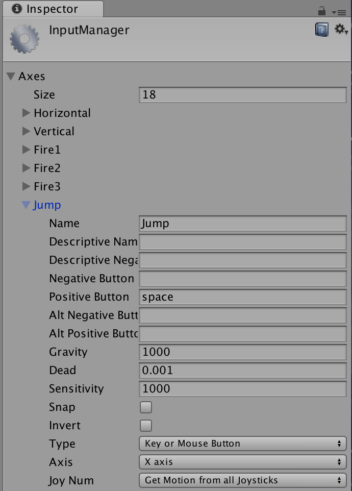
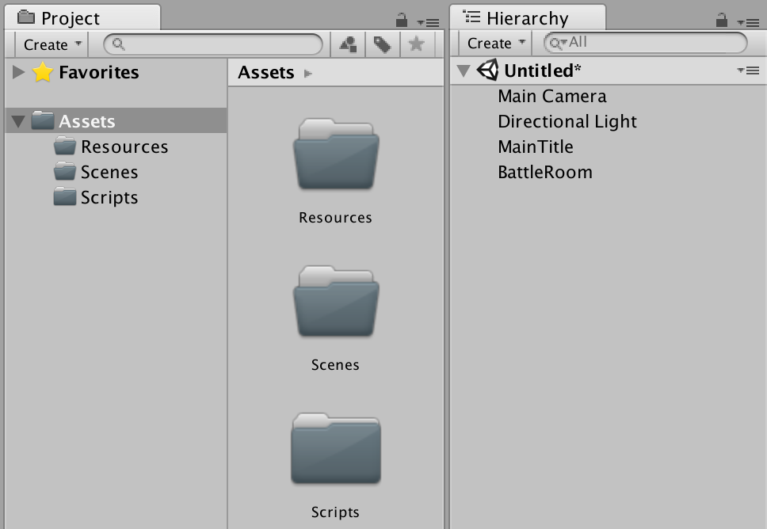
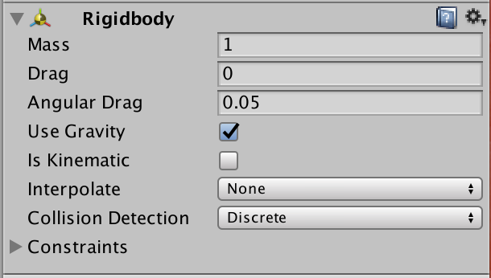

#### 회전

```cs
public class Basic_Rotate : MonoBehaviour {

    void Update () {

        if( Input.GetKey(KeyCode.LeftArrow) == true ) {
            transform.Rotate( Vector3.up * moveSpeed * Time.deltaTime);
        }
        if( Input.GetKey(KeyCode.RightArrow) == true ) {
            transform.Rotate( -Vector3.up * moveSpeed * Time.deltaTime);
        }
        if( Input.GetKey(KeyCode.UpArrow) == true ) {
            transform.Rotate( -Vector3.right * moveSpeed * Time.deltaTime);
        }
        if( Input.GetKey(KeyCode.DownArrow) == true ) {
            transform.Rotate( Vector3.right * moveSpeed * Time.deltaTime);
        }
    }
}
```

#### 이동


```cs
public class Basic_Move : MonoBehaviour {

    public int Speed;

    // Update is called once per frame
    void Update () {
        if (Input.GetKey (KeyCode.LeftArrow)) {
            transform.Translate (Vector3.left * Speed * Time.deltaTime);
        }   
        if (Input.GetKey (KeyCode.RightArrow)) {
            transform.Translate (Vector3.right * Speed * Time.deltaTime);
        }   
        if (Input.GetKey (KeyCode.UpArrow)) {
            transform.Translate (Vector3.forward * Speed * Time.deltaTime);
        }   
        if (Input.GetKey (KeyCode.DownArrow)) {
            transform.Translate (Vector3.back * Speed * Time.deltaTime);
        }   
    }
}
```

> `Time.deltaTime` 
> 앞 프레임과 현재 프레임 간의 시간 간격을 의미한다. 예를 들어 10프레임 출력시 성능이 좋은 기기는 deltaTime이 0.1 일 수 있고, 성능이 떨어지는 기기는 0.2 같이 커진다. 그래서 기기 사이의 성능을 보정해 줄 수 있다.


> Vector3
> (x,y,z) 3차원 방향 값을 가진 데이터 형식.


#### Script Impoter

이제 스크립트 폴더에서 Basic_move.cs 를 게임 객체 Capsule에 얹으면 인스펙터에서 Basci_Move 스크립트 속성이 추가돈다. 여기서 `public Speed` 속성의 값을 넣으면 된다.


#### Rigibody 의 Constraints

Rigibody의 물리적 작용에 대해 제약을 선택할 수 있어서 Position과 Rotation에 대해 정지(Freeze)를 지정할 수 있다.


#### 몸체 방향 전환

캡슐에 얼굴을 달아 얼굴이 방향(direction)을 표시한다고 가정하자. 키보드 등의로 캡슐의 방향이 정해지면 몸체도 방향(direction)에 따라 회전한 후에 이동하게 해보자.


```cs
public class Move : MonoBehaviour {

    public float MoveSpeed;
    Vector3 lookDirection;

    // Use this for initialization
    void Start () {
        
    }
    
    // Update is called once per frame
    void Update () {
        if (Input.GetKey (KeyCode.LeftArrow) ||
           Input.GetKey (KeyCode.RightArrow) ||
           Input.GetKey (KeyCode.UpArrow) ||
           Input.GetKey (KeyCode.DownArrow)) {

            float xx = Input.GetAxisRaw ("Vertical");
            float zz = Input.GetAxisRaw ("Horizontal");
            lookDirection = xx * Vector3.forward + zz * Vector3.right;

            // turn to the lookDirection
            this.transform.rotation = Quaternion.LookRotation ( lookDirection);
            this.transform.Translate (Vector3.forward * MoveSpeed * Time.deltaTime);
        }
    }
}
```


### Key 와 Button

http://johnstejskal.com/wp/understanding-getbutton-and-getkey-inputs-in-unity/

GetKey = machine gun

```
function Update () {
        if (Input.GetKey (KeyCode.Space))
            print ("space key is being held down");
    }
```

GetKeyDown =  single shot gun

```
function Update () {
        if (Input.GetKeyDown (KeyCode.Space))
            print ("space key was pressed once");
    }
```

finally we have the key released handler

```
function Update () {
        if (Input.GetKeyUp (KeyCode.Space))
            print ("space key was released");
```

https://docs.unity3d.com/ScriptReference/KeyCode.html


#### Buttons

버튼 입력을 인식해서 처리할 수 있다.

```cs
function Update () {
        if (Input.GetButtonDown ("Jump"))
            print ("space bar was pressed");
    }
```

```cs
function Update () {
        if (Input.GetButtonDown ("Fire1"))
            print ("left mouse button was pressed");
}
```

입력에 대한 설정은 Edit > Project Settings > Input 을 확인한다. Fire1, Fire2, Jump 등 알려진 게임 콘솔의 버튼을 키보드와 연결시킬 수 있다.



InputManager에 대해서는 [class-InputManager](https://docs.unity3d.com/Manual/class-InputManager.html) 를 참조한다.

### 충돌

게임 캐릭터가 이동해 주변의 블록에 충돌하면 블록을 모두 떨어 뜨리는 과정을 생각해 보자. 모두 떨어지면 "완료" 메시지를 띄운다.

초보자를 위한 위니티 5 입문

## 공 굴려 보기

앞서 만든 지형에에서 Sphere 를 물리적인 힘으로 굴려 보자. 굴리는 방법은 화살표 키로 입력을 하면 해당 강도 만큼 공이 바닥면에서 구르게 된다.

바닥에 공이 있고 Rigidbody의 물리적 특성으로 움직이게 해보자.

## Rigid body

Rigid body(강체(剛體)란 물리학에서 형태가 고정되어 변하지 않는 물체를 가리킨다. 


### 환경 구성하기

바닥을 만들어야 게임 객체들이 배치되고 움직일 수 있다. 바닥을 만들기 위해 새 plane 추가하고 position을 (0,0,0)으로 한다.
그리고 Sphere 객체를 추가하고 위치를 (0,0.5,0) 으로 해주면 바닥면에 닿게 배치가 된다.

Assets 폴더에 Scenes, Scripts, Materials 폴더를 추가한다.




#### Rididbody 추가하기

Rigidbody는 Components 메뉴 혹은 Inspector window에서 게임객체에 추가할 수 있다.

- 게임 객체를 선택하고 **Compnent -> Physics -> Gigidbody** 를 추가한다.
- Inspector Window에서 **Add Components** 에서 추가한다.



Rigidbody에서 중력관련한 선택 사항은,

 - Use Gravity: 중력 사용
 - Is Kinematic: 객체가 스크립트로만 동작한다.

이제 Rigidbod를 가진 객체에 방향키에 따라 움직임을 주려면 스크립트를 이용한다.

#### Pyshics Material 추가하기

공이 힘차게 굴러가게 보이도록 해야
공과 바닥 사이의 마찰을 줄이면 OK
Project 뷰에서 Physic Material 추가 후 오브젝트에 적용
드래그 앤 드롭으로 편리하게 사용  

#### Material 추가하기

공의 색을 변경하려면 Material을 추가해서 공의 재질을 추가한 재질로 변경해 주면 된다.
공의 색 변경하기 (p.97~99)
공이 눈에 잘 띄도록 색깔 변경 
Project 뷰에서 Material 추가 
알아보기 쉽도록 이름 변경과 색깔 선택

Project 뷰에 추가한 머티리얼
Hierarchy 뷰의 오브젝트에 드래그 앤 드롭해 사용 
머티리얼을 변경하면 머티리얼을 적용한 오브젝트도 변경 


## 참조
 - [Using sublime Text as Script Editor](http://wiki.unity3d.com/index.php/Using_Sublime_Text_as_a_script_editor)