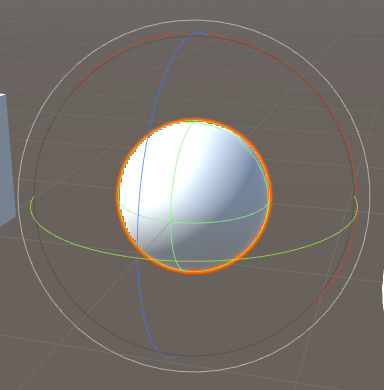
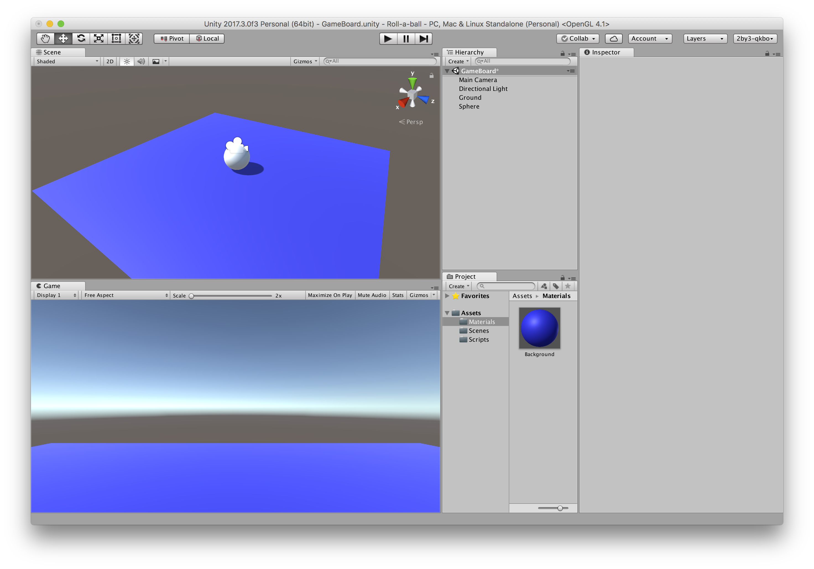
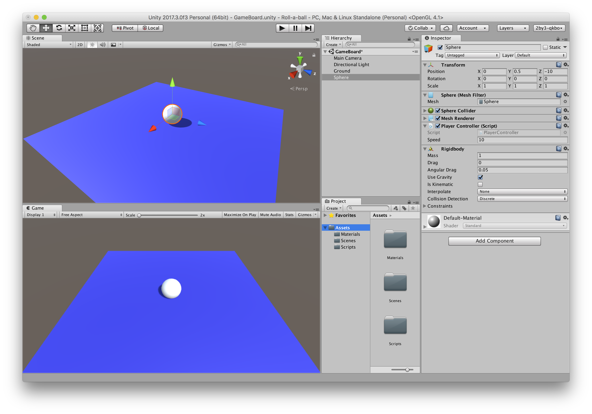
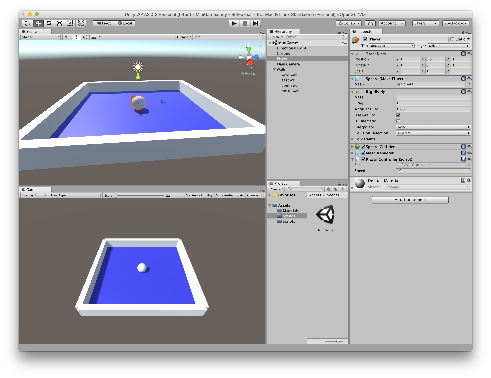

## Roll a Ball

카메라와 키보드를 이용해 게임 뷰를 조작해 보자.

https://unity3d.com/kr/learn/tutorials/projects/roll-ball-tutorial/moving-player?playlist=17141

### Environment

기본 프로젝트를 생성한다.

Assets 폴더 밑에 아래 폴더를 만든다.
 - Materials
 - Scenes
 - Scripts


#### Player 움직이기

Plane 을 추가해 게임보드 Ground로 이름 짓는다. 위치는 (0,0,-10)으로 지정한다.

그리고 Sphere를 추가해 Player로 이름 짓는다. 위치는 (0,0.5,-10)으로 위치한다.



Project 뷰에서 Materials 밑에 새 Material 을 추가하고 이름을 Background로 주고, 적당한 색을 지정한다. 이 오브젝트를 드래그해서 씬 뷰의 게임보드 Ground 위치 두면 색을 지정할 수 있다.



이제 오브젝트를 움직여 보기 위해서, 물리작용을 하는 콤포넌트를 추가해야 한다.
Player 를 선택하고 Inspector에서 Add component 버튼을 눌러, Physics -> Rigidbody를 추가한다.

Scripts 폴더에서 마우스 오른쪽 혹은 메뉴에서 새 스크립 PlayerController.cs 을 추가한다.
Unity에서 제공하는 API는 에디터에서도 검색할 수 있는데, macOS: *Cmd+'* 혹은 *Ctrl+'* 이다.

```cs
using System.Collections;
using System.Collections.Generic;
using UnityEngine;

public class PlayerController : MonoBehaviour {

    public float speed;
    private Rigidbody rb;

    void Start()
    {
        rb = GetComponent<Rigidbody>();
    }

    void FixedUpdate()
    {
        float moveHorizontal = Input.GetAxis ("Horizontal");
        float moveVertical = Input.GetAxis ("Vertical");

        Vector3 movement = new Vector3 ( moveHorizontal, 0.0f, moveVertical);

        rb.AddForce (movement * speed);
    }
}
```


##### FixedUpdate()

물리작용에 대한 계산은 FixedUpdate()에서 한다. 입력의 수평, 수직 좌표를 받아와 게임 객체에 물리적 힘을 `addForce()` 로 주면 게임 객체가 움직이게 된다.


이 스크립을 드래그해서 Player 오브젝트에 추가하면 된다.




### Camera & Play area

#### Camera 시점으로 움직이기

Player를 이동해 보면 고정된 화면에서 Player 위치가 변경된다. 그런데 게임 씬이 방대하게 크면 화면에서 사라져 보일 것이다. 그래서 플레이어가 카메라 시점으로 움직일 필요가 있다.

먼저 간단하게 Player 밑에 카메라를 두고 움직여 보자.


##### CameraController.cs

Player 위치와 카메라 사이 거리를 offset으로 삼아 Update() 후 카메라 위치를 재설정 하는 것이다.


```cs
using System.Collections;
using System.Collections.Generic;
using UnityEngine;

public class CameraController : MonoBehaviour {

    public GameObject player;

    private Vector3 offset; // between player from camera

    // Use this for initialization
    void Start () {
        offset = transform.position - player.transform.position;
    }
    
    // LateUpdate is called per frame after all update have been called
    void LateUpdate () {
        transform.position = player.transform.position + offset;
    }
}
```

CameraController.cs를 카메라 스크립트로 추가하고, `player` 필드에 Player 객체를 드래그한 후에 실행해 본다.


#### Setting up the Play Area 

플레이어가 떨어지지 않게 게임보드 주변에 벽을 세워서 보호를 해보자.

##### Wall

빈 게임 오브젝트를 추가해 Walls 라고 한다. 이 Walls 밑에 여러 Cube 를 추가해 벽을 쌓게 할 것이다.
추가한 Walls 오브젝트를 Reset 으로 초기 위치 (0,0,0) 배치를 하도록 해준다.


큐브를 추가해 West wall 이라고 하고, Reset 해 준다.
 그 아래 Cube 를 추가한다.





### Collecting, Scoring and Building the game

#### Creating Collectable Objects

https://www.youtube.com/watch?v=HlDGSStxuHI

새 Cube를 추가하고, Reset해서 위치등을 초기화 하고 이름을 pickup이라 하자, 그리고 **F** 키로 선택된 뷰를 

x,y,z을 45도로 주고

새 Cube 개체를 회전 시키기 새 스크립트 Rotator.cs 를 추가한다.

그리고 위해 게임 오브젝트에 내장된 Transform 객체 `transform` 을 사용한다. Transform에서 `Rotate()`, `Transform()` 함수를 사용해서 개체를 조정할 수 있다.

Rotate는 두가지 표현으로 사용 가능하다.

```cs
public void Rotate (Vector3 eulerAngles, Space relativeTo= Space.Self);

public void Rotate (float xAngle, float yAngle, float zAngle, Space relativeTo= Space.Self);
```

개체를 (15,30, 45) 도 축으로 회전시키는 다음 코드를 

```cs
public class Rotator : MonoBehaviour {

    void Update () 
    {
        transform.Rotate (new Vector3 (15, 30, 45) * Time.deltaTime);   
    }
}
```

이제 재생으로 확인해 보자.

다음은 위 큐브 객체를 Prefab 으로 

> Prefabs은 씬에서 재사용될 수 있는 게임오브젝트와 구성요소의 집합체로, 몇 개의 동일한 오브젝트들이 하나의 Prefab에서 만들어질 수 있다. 장점으로 한 프리팹을 업데이트하면 모든 프리팹에 적용이 가능하다.

Assets 폴더에 Prefabs 폴더를 만든다. 그리고 pickup 객체를 Pickups 로 드래그해서 듣옭한다.

빈 게임오브젝트를 생성해 PickUPs 라고 한다. 이곳에 Pickup을 아래로 놓는다.

씬 뷰를 Y축, Top 화면으로 볼 수 있도록 한후에, 상대적으로 이동할 수 있도록 Global view 로 바꾼후에 사용하낟.
> 로컬로 pickup을 이동하면 고정되지 않고, 게임보드와 떨어져 이동된다.


##### Material로 색 바꾸기

기존 Materials/Background 를 복제해 pickup 으로 바꾼다.
pickup material의 인스펙터에서 색을 변경한다.

Prefab 에 material을 적용하는 두가지 방법
 (1). 씬 뷰의 오브젝트에 적용후 인스펙터에서 apply 하면 모든 프리팹에 적용
 (2). material을 Prefabs 안의 객체에 직접 드래그해 주면 모든 프리팹 요소에 적용.


##### 내장 멤버 속성

Inherited members 
https://docs.unity3d.com/kr/current/ScriptReference/Transform.html

Variables

| 변수        |  설명 |
| ---------- | -------------------------------------------------------------- |
| gameObject | The game object this component is attached to. A component is always attached to a game object.|
| tag | The tag of this game object. |
| transform  | The Transform attached to this GameObject. |
| hideFlags  | Should the object be hidden, saved with the scene or modifiable by the user?|
| name  |  The name of the object.|


#### Collecting the Pick Up Objects

이제 Player와 Pickup 의 충돌을 처리한다. Player와 Pickup이 닿게 되면 하나씩 충돌시 획득하는데, 이를 위해서 Player의 충돌에 대한 UNITY API는 Collider 에서 지원한다.

Player 선택하고 인스펙터 Sphere Collider 속성의 Help 아이콘을 클릭하면 API 사이트가 표시된다. ApI에서 도움될 만한 메시지를 보면 

Messages

|        변수        |  설명 |
| ----------------- | ------------------------------------------------------- |
| OnCollisionEnter  |  `OnCollisionEnter` 는 collider/rigidbody 가 다른 rigidbody/collider 에 닿으면 발생한다.|
| OnCollisionExit   | `OnCollisionExit` 이 collider/rigidbody가 다른 collider/rigidbody 터치를 마무리하면 발생한다|
| OnCollisionStay   | `OnCollisionStay`는 터치한 collider/rigidbody에 프레임당 한번 불려진다. |
| `OnTriggerEnter`    | `OnTriggerEnter` 는 콜라이더가 다른 콜라이더에 진입하면 발생한다.|
| OnTriggerExit     |  `OnTriggerExit` is called when the Collider other has stopped touching the trigger.|
| OnTriggerStay     |  `OnTriggerStay` is called almost all the frames for every Collider other that is touching the trigger.|

`OnTriggerEnter` 는 아래 같은 형식

```
Collider.OnTriggerEnter(Collider)
```

```cs
public class ExampleClass : MonoBehaviour {
    void OnTriggerEnter(Collider other) {
        Destroy(other.gameObject);
    }
}
```

##### Tag

GamgeObject에는 tag 속성이


재생중에 mac은 command 키를 pc는 control 키를 누르고 게임오브젝트를 선택하면 인스펙터 정보를 확인할 수 있다.


#### Displaying the Score and Text

https://www.youtube.com/watch?v=bFSLI2cmYYo


#### Building the Game


