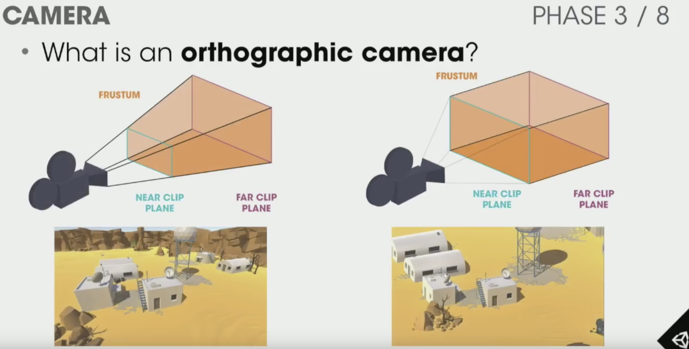
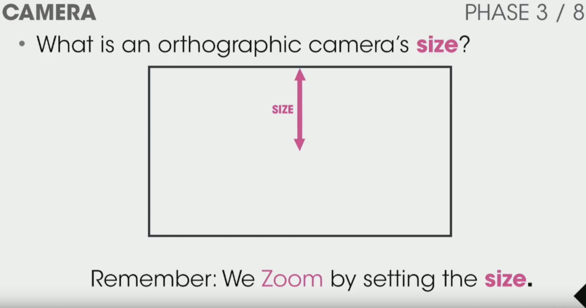
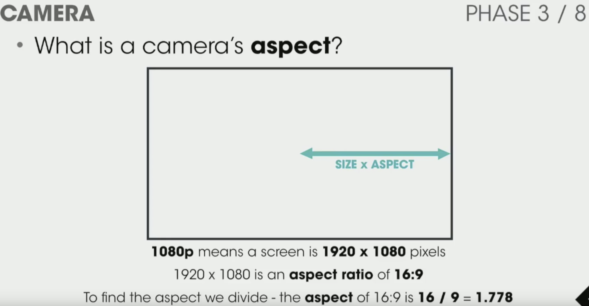
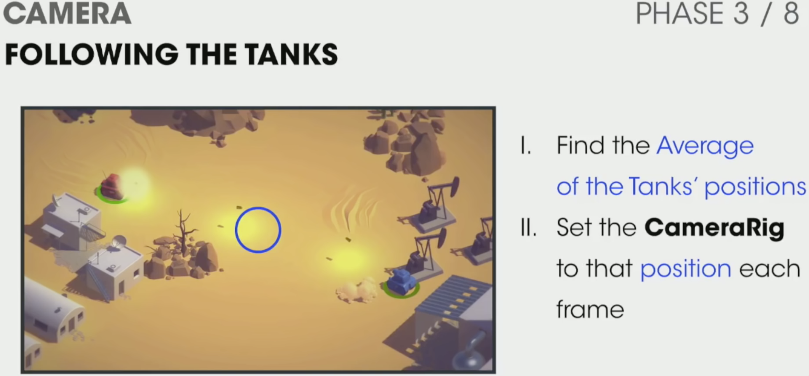
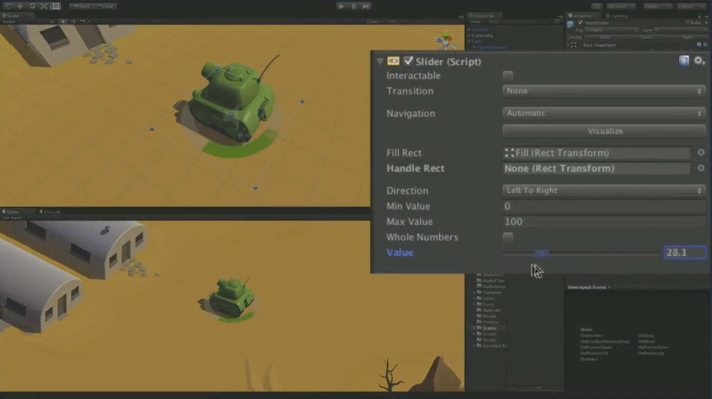

## Tankgame

이 튜토리얼을 따라하기 위해서는
 - Unity3d Project 생성 및 뷰 레이아웃

https://unity3d.com/kr/learn/tutorials/s/tanks-tutorial

### Project

1.새 프로젝트를 만들고 씬 뷰와 게임 뷰 및 폴더를 구성한다.
2.Download the project from the asset store, just search for Tanks tutorial 3.Import the files from the Asset store package

https://assetstore.unity.com/packages/essentials/tutorial-projects/tanks-tutorial-46209

유니티 레이아웃을 2-by-3 레이아웃을 권장한다.

#### 기본 프로젝트 설정

씬을 Main 으로 저장한다.

그리고 기본 조명인 Directional Light를 삭제한다.

### Phase Three

https://www.youtube.com/watch?v=llEJtLuQyPM

Camera 뷰는 3차원 절단면을 보거나, 2차원 고정체 카메라가 있다.

Camera 뷰의 크기는 Zoom in과 out 이다.

Camera 뷰의 비율은 화면 비율이다.

#### 

카메라는 두 탱크 위치의 평균을 카메라의 위치로 잡는다.

### Phase Four: Tank health

슬라이드 콤포넌트를 사용해 탱크의 활기를 표시한다.

Make sure the transform toggle above the Scene View is set to Pivot and not Center 

Create a Slider usingGameObject > UI > Slider from the top menu

View를 Local로 한 후에, UI->Slide 를 추가한다.

그리고 eventSystem

Select the EventSystem GameObject 

2.On the Standalone Input Module component change the Horizontal Axis to HorizontalUI 

3.Set the Vertical Axis to VerticalUI

4.Select the Canvas GameObject 

5.On the Canvas Scaler component change the Reference Pixels per Unit to 1

6. On the Canvas component of the CanvasGameObject change the Render Mode to World Space

