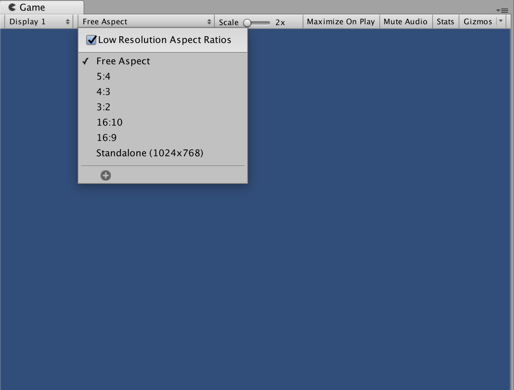
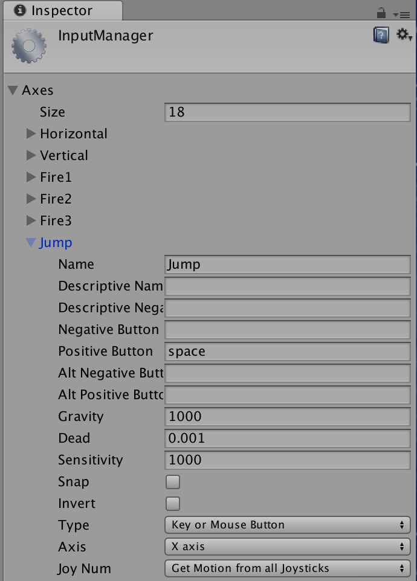

## 게임 기획


#### 사양

캐릭터 앞에 길이 보이고 가로 방향으로 진행한다. 그래픽 해상도는 FHD 1920x1080 으로 한다.

이미지
 - 캐릭터 달리기, 점프 동작, 스테이지의 길, 


### 프로젝트 생성

#### 게임뷰 화면

프로젝트 기본으로 게임뷰는 Free Aspect 모드로 실제 타깃에서 화면이 달라 보일 수 있다. 게임뷰 크기를 타깃에 맞게 설정해 준다. 



여기서 FHD 로 설정한다.

#### 타깃 플랫폼의 화면 크기

타깃 플랫폼의 크기는 *Edit -> Project Setting -> Player* 를 실행하면 인스펙터 뷰의 Player settings 에서 설정할 수 있다. 


#### 스프라이트 가져오기

Assets 폴더에 Scenes, Sprites, Scripts, PhysicsMaterials 폴더를 만든다.


#### 소팅 레이어 설계

유니티 에디터 오른쪽 위에 있는 Layers 드롭다운 메뉴에서 Edit Layers 를 선택해서 소팅 레이어를 작성한다. Back, Road, Object, Char, Front 소팅 레이어를 사용하자. 


#### 물리엔진

게임을 제작시 물리엔진을 적용하는 방법은

1. 직접 프로그래밍: 고전적 방법
2. 물리엔진 이용
3. 메카님으로 애니메이션 만들기


### 1. 직접 프로그래밍 하기

스프라이트 처리, 애니메이션을 직접 다루는 방법이다. 

#### C# 스크립트

시작함수

|    Start point    |                     |
| ----------------- | ---------------------------------------------------- |
| Awake()           | - 스크립트가 실행될 때 한 번만 호출하는 함수이다. - 주로 게임의 상태 값 또는 변수 초기화에 사용한다. - Start함수가 호출되기 전에 맨 먼저 호출된다. - 스크립트가 비활성화돼 있어도 실행된다. - Coroutine 사용 불가 |
| Start()           | - Update 함수가 호출되기 전에 한 번만 호출된다.
 - 스크립트가 활성화돼 있어야 실행된다.
 - 다른 스크립트의 모든 Awake가 모두 다 실행된 이후에 실행된다.|
| Update()          |- 프레임마다 호출되는 함수로 주로 게임의 핵심 로직을 작성한다.
 - 스크립트가 활성화돼 있어야 실행된다.|
| LateUpdate() | - 모든 Update 함수가 호출되고 나서 한 번씩 호출된다.
 - 순차적으로 실행해야 하는 로직에 사용한다.
 - 카메라 이동 로직에 주로 사용하는 함수다.
 - 스크립트가 활성화돼 있어야 실행된다.|
| OnFixedUpdate()   | - 주로 물리 엔진을 사용하는 경우에 일정 시간 간격으로 힘을 가할때 사용하는 함수다.  - 발생하는 주기가 일정하다.|
| OnEnable()        | - 게임오브젝트 또는 스크립트가 활성화됐을 때 호출된다. - Event 연결 시 사용한다.  - Coroutine 사용 불가.|
| OnDisable()       | - 게임오브젝트 또는 스크립트가 비활성화됐을 때 호출한다. - Event 연결을 종료할 때 사용한다. - Conroutine 사용불가.|
| OnTriggerEnter()  |
| OnTriggerStay()   |
| OnTriggerExit()   |
| OnGUI()           |  GUI 관련 함수를 사용할 때 사용한다. |


#### Public 변수

스크립트에서 *pulblic* 변수는 스크립트 임포터의 Inspector에서 값을 편집할 수 있다. 이것은 `MonoBehaviour` 클래스를 상속한 클래스는 직렬화를 거쳐 *public* 변수를 자동으로 인스펙터에 편집할 수 있게 해주는 유니티의 기능 때문이다.

```cs
public class MyPlayer : MonoBehaviour {
  public float speed = 15.0f; 
  public Sprite[] run;
}
```

이렇게 편집한 값은 씬을 저장할 때 다른 정보와 함께 메타 정보로 저장된다. 수정된 값은 해당 인스펙터의 설정 버튼에서 *Reset*을 하면 public 초기 값으로 초기화 된다.

> 단, 한 번 설정한 public 변수 초기값은 컴파일시 메타 파일에 저장되어, 소스에서 public 값을 수정해도 메타정보에 있는 초기값으로 표시된다. 그러므로 초기값을 변경하고자 하면 소스 수정후 씬을 저장후 인스펙터에서 Reset 해주어야 한다.

#### 가변 프레임과 고정 프레임

`Update()` 메시지는 프레임 마다 호출되는데 같은 시간에 호출되는게 아니고 처리 속도가 느려지면 Update 호출 타이밍은 불규칙한 처리를 하는 가변 프레임 방식을 사용한다.

가변 프레임은 1초 동안 실행되는 화ㅕㄴ 갱신 처리 횟수가 항상 달라지므로 바로 전 프레임이 렌더링 되고 나서 부터 지난 시간 만큼 처리를 진행한다는 개념으로 프로그래밍 한다. 프레임 레이트가 불안정해서 화면 끊김 현상은 나타나지만 전체적으로 최소 영향만 받는다. 그래서 Update 처리가 생략되면 캐릭터가 순간 이동한 듯한 느낌이 들게 된다.

고정 프레임을 사용할 때 처리가 느려지면 1프레임이 소요되는 장명이 2,3 프레임 정도 느려질 수 있다.


#### 가변 프레임 구현

Update 바로 전 시간 차이인 Time.deltaTime 을 응용하면 가로로 이동하고자 하는 *속도 x Time.deltaTime* 으로 계산할 수 있다. 다만 부동소수인 시간 값을 더해서 계산하는 것으로 오차가 생길 수 있다.

```cs
transform.position = new Vector3(
  transform.position.x + speed * Time.deltaTime, 
  height, 
  0.0f
);
```

#####  Transform 콤포넌트

Transform component의 속성

|  속성 이름       |    데이터  |                     설명                    |
| ---------------- | ---------- | ------------------------------------------- |
| position         | Vector3    | 월드좌표 안의 오브젝트 위치                        |
| rotation         | Quaternion | 월드좌표에서 오브젝트 회전 각도                     |
| eulerAngles      | Vector3    | 월드좌표에서 오브젝트 오일러 각도 (360도 단위)         |
| lossyScale       | Vector3    | 월드좌표에서 오브젝트의 크기 (readonly)  |
| localPosition    | Vector3    | 로컬좌표에서 오브젝트의 위치 |
| localRotation    | Quaternion | 로컬좌표에서 |
| localEulerAngles | Vector3    | |
| localScale       | Vector3    | 로컬좌표에서 오브젝트의 크기                        |
| forward          | Vector3    | 오브젝트의 앞 방향 벡터 (로컬좌표 Z축 방향) |
| right            | Vector3    | 오브젝트의 오른쪽 방향 벡터 (로컬좌표 X축 방향) |
| up               | Vector3    | 오브젝트의 위쪽 방향 벡터 (로컬좌표 Y축 방향) |
| hasChanged       | bool       | 좌표,회전,크기 변경시 True |
| localToWorldMatrix | Matrix4x4 | 로컬좌표에서 월드좌표로 변환한 행렬 (read only) |
| worldToLocalMatrix | Matrix4x4 | 월드좌표에서 로컬좌표로 변환한 행렬 (read only) |


Transform component의 메서드

|     메서드 이름      |                         설명                           |
| ----------------- | ----------------------------------------------------- |
| Translate         | 오브젝트를 상대적으로 이동한다. |
| Rotate            ||
| RotateAround      | 중심점을 지정하고 중심점을 지나는 회전축을 Vector3로 지정한 후 회전축을 기준으로 오브젝트를 회전시킨다.|
| TransformPoint    | 로컬좌표계 위치를 월드좌표계로 변혼한다. |
| TransformDirection | 로컬좌표계 방향벡터를 월드좌표계 방향벡터로 변환한다. |
| LookAt | 오브젝트를 특정 위치로 향하게 한다. |
| InverseTransformPoint | 월드좌표계 위치를 로컬좌표계 위치로 변환한다 |
| InverseTransformDirection | 월드좌표계 방향 벡터를 로컬좌표계 방향 벡터로 변환한다.|


#### Vector2와 Vector3 구조체

Vector3는 (x,y,z) 3차원 방향 값을 가진단 정밀도 부동소수점 데이터 형식이다. [^Vector3 구조체]
Vector2는 (x,y,z) 2차원 값을 가진 단정밀도 부동소수점 데이터 형식이다. [^Vector2 구조체]


[^Vector3 구조체]: https://msdn.microsoft.com/ko-kr/library/system.numerics.vector3(v=vs.111).aspx
[^Vector2 구조체]: https://msdn.microsoft.com/ko-kr/library/system.numerics.vector2(v=vs.111).aspx


#### Quaternion 

2차원 평면의 벡터를 두 개의 복소수로 회전 시키는데, 3차원 벡터를 회전 시키기 위해 4개의 복소수를 사용하는 것을 사원수 Quaternion 이라고 한다. 유니티에서 이를 Quaternion 구조체로 제공하고 있다. [^Quaternion]

Constructors

|  생성자 함수     |  설명  |
| ---------------- | ---------- |
| Quaternion | Constructs new Quaternion with given x,y,z,w components. |


|  변수 이름       |    데이터  |                     설명                    |
| ---------------- | ---------- | ------------------------------------------- |
| x,y,z,w        | float    | x,y,z,w 요소 (readonly)                        |
| this[int]      | float    | x,y,z,w 값을 참조할 수 있는 배열  |
| (s)*identity*   | Vector4 | |


[^Quaternion]: https://docs.unity3d.com/kr/current/ScriptReference/Quaternion.html

#### InputManager

버튼 입력을 인식해서 처리할 수 있다.

```cs
function Update () {
        if (Input.GetButtonDown ("Jump"))
            print ("space bar was pressed");
    }
```

```cs
function Update () {
        if (Input.GetButtonDown ("Fire1"))
            print ("left mouse button was pressed");
}
```

입력에 대한 설정은 Edit > Project Settings > Input 을 확인한다. Fire1, Fire2, Jump 등 알려진 게임 콘솔의 버튼을 키보드와 연결시킬 수 있다.



InputManager에 대해서는 [class-InputManager](https://docs.unity3d.com/Manual/class-InputManager.html) 를 참조한다.


#### 스프라이트 애니메이션

게임 개체를 점프, 가로 이동에 대해 랜덩링하기 위해서 스프라이트를 표시하는 Sprite Renderer의 Sprite 속성로 실시간으로 스프라이트 이미지를 교체할 수 있다.

다음은 점프 스프라이트 이미지 와 달리기 스프라이트로  전환

```cs
public Sprite[] run;        // 플레이어 캐릭터 달리기 스프라이트
public Sprite[] jump;       // 플레이어 캐릭터 점프 스프라이트

GetComponent<SpriteRenderer>().sprite = jump[0];
GetComponent<SpriteRenderer>().sprite = run[animIndex];
```


#### 화면 스크롤

플레이어가 이동시 카메라도 이동하려면 GameObject.Find() 메서드로 게임 객체를 찾아내야 한다. 아래 같이 카메파를 찾고 현재 플레이어 속도에 맞게 카메라를 함께 이동해 준ㄷ.

```cs
GameObject goCam = GameObject.Find("Main Camera");
goCam.transform.Translate(speed * Time.deltaTime, 0.0f, 0.0f);
```


#### 장애물과 초기화

플레이어 객체가 장애물과 충돌하면 `OnCollisionenter2D()` 메시지가 발생하고 닿은 정보를 담은 Collider2D 객체를 전달받아 처리한다.

```cs
// 플레이어 캐릭터가 개체의 충돌 영역에 들어간다.
void OnCollisionEnter2D(Collision2D col) {

  if(col.gameObject.name == "Stage_Gate") {
    goalCheck = true;
    return;
  }
  Application.LoadLevel(Application.loadedLevelName);
}
```


#### OnGui() 메시지

유니티 GUI는 OnGUI() 메시지를 이용해 Text label, Button 같은 사용자 인터페이스를 표시할 수 있다.

```cs
void OnGUI() {
  // 디버그
  GUI.TextField(new Rect(10, 10, 300, 60),
                "[Unity 2D Sample 3-1 A]\n마우스 왼쪽 버튼을 누르면 가속\n놓으면 점프");
  // 리셋 버튼
  if(GUI.Button(new Rect(10, 80, 100, 20), "리셋")) {
    Application.LoadLevel(Application.loadedLevelName);
  }
}
```


#### 방향과 각도

유니티에서 사용하는 방향과 회전에 대한 각도

| 표현 | 설명 |  용도 |
| ---------------- | ---------- | ------------------------------------------- |
| 도수법 | float 형식. 10진수로 360도가 1회전 | Transform의 Rotation 등 3차원 방향을 표시하는 오일러각이 도수법을 사용 |
| 라디안 | float 형식. 0~2.0pi 사이 값으로 표시되는 각도. | Mathf.sin에 속한 삼각함수에서 사용 |
| 오일러각 | Vector3 형식. x,y,z 축 회전 각도를 표현 | `Transform.localEulerAngles`, `Transform.rotation = Quaternion.Euler()` 처럼 오일러 값을 사원수 값으로 변환해 방향 지정 가능 |
| 벡터 | Vector3, Vector3 형식. 크기와 방향 스칼라 값을 계산을 통해 각도 구한다. | Transform.forward 같이 방향을 가진 값 |
| 사원수 | 회전을 사원수로 표현한 것. 오일러 각에 의한 회전은 3축을 자유롭게 회전시키면 짐벌락이라는 현상이 발생하는 경우, 사원수에서는 이 현상이 발생하지 않는다. | Transform.rotation 값으로 사용. 기보적으로 Quaternion을 통한 회전을 사용. 그래서 Transform.rotation 같은 회전함수 사용시 오일러 값으로 지정해도 Quaternion 을 통한 회전을 한다. |

벡터와 사원수의 방향에 대해 [TransformDirection](http://unityindepth.tistory.com/74) 글을 참조해 볼 것.


#### 장. 단점

직접 스프라이트를 다룰 때 배경, 스테이지의 변경시 많은 작업이 필요하다. 예를 들어 위 스페이지를 위로 향하는 것으로 변경해도 캐릭터는 transform.position.y 좌표로 높이만 관리해서 닿는 부분을 y좌표로만 판단해서, 언던, 구멍 등에 닿았을 때 판단이 어렵게 된다. 그래서 언덕 같은 스페이지를 꾸미려면 높은 수준의 프로그래밍을 해야 한다.

완성된 예제는 Sample3_0_RunnerGame 이다.


### 2. 물리엔진을 최대한 활용해서 만들기

앞 스테이지는 transform.position.y 좌표를 사용해 충돌을 판정해서 바닥에 닿을 때 컬라이더를 사용해서 충돌 판정을 할 수 있지만, 점프시에 벽/문 등에 닿았는지에 대한 판정을 하지 않아 점프가 가능하다. 
그래서 빈 객체를 하나 플레이어 밑에 두고 문의 영역에 들어 왔는지를 점 충돌 방식으로 넣어 보자.

앞의 StageA 씬을 StageB 씬으로 저장해서 계속 사용하고 있다.


#### GroundCheck 개체

빈 게임 개체 GroundCheck 를 추가한다. 그리고 플레이어 개체의 밑에 배치하고, 인스펙터의 아이콘을 클릭해 아이콘으로 표시되게 해준다.

#### 스페이지 충돌 판정

Stage_Road_A 개체를 모두 선택하고 Box collider 2d 를 추가해 준다. 그리고 충돌 size와 오프셋을 적절히 조정한다. 

> 이 개체들은 충돌 판정 정보를 주는 쪽이므로 Rigibody는 필요없다.

그리고 플레이어에 대한 스크립을 작성한다.


#### Player 스크립트

플레이어에 새 스크립트 Player_Physics2D 를 대입해 주고 인스펙터에서 기존 스크립은 삭제한다.
Rigidboxy의 그레비티 스케일을 1로 한다.


#### 물리엔진의 물리 연산

유니티의 물리엔진은 Time.fixedDeltaTime 속성에 설정된 간격으로 물리연산 처리를 한다. 이 처리를 호출해 주는 메시지가 FixedUpdate 메시지 함수이다. fixedDeltaTime 은 Project settings > Time 을 선택하면 기본 설정 값이 0.02로 1초에 1/0.02 즉 50회 동안 처리한다는 것을 확인할 수 있다.

즉 랜더링 처리는 Update() 메시지에서 하고 물리 연산은 FixedUpdate() 메시지를 따로 사용한다.

이벤트 함수의 실행 순서는 https://docs.unity3d.com/Manual/ExecutionOrder.html 를 확인해 보면 fixedDeltatime 안에 랜더링이 갱신되면 FixedUpdate()는 호출되지 않는다.


타깃 성능이 빠르면 Update()가 FixedUpdate()보다 많이 호출되고, 반대면 FixedUpdate() 가 많이 호출되기도 한다. 또한 FixedUpdate는 처리 누락시 FixedUpdate를 누락 시간만큼 여러번 실행하게 된다.

Input 클래스는 Update 메시지 타이밍에 맞춰져 있어서 입력 버튼, 키에 대한 처리는 Update()에서 해야 한다. 예를 들어 Input.ButtonDown 함수를 Update()에 구현했다면 버튼을 누르는 한 번만 정보를 가져온다. 
그러나 FixedUpdate에서 정보를 얻으려 하면 Updatae, FixedUpdate 처리의 빈도 때문에 여러번 눌렀다고 판단할 수 있다.

결론적으로 Update에서는 랜더링에 관련해서 입력과 플레이어의 전환등을 처리하고, FixedUpdate는 물리 엔진을 이용한 이동 연산을 처리하는 것이다.


#### 물체의 이동 속도 Veleocity

FixedUpdate에서 RigidBody의 velocity 속성을 이용해서 이동을 나타내는데, 이동 속도를 현재 플레이어의 위치를 Vector2 로 지정해주면 된다.

```cs
void FixedUpdate () {
  // 이동 계산
  GetComponent<Rigidbody2D>().velocity = new Vector2 (speed, GetComponent<Rigidbody2D>().velocity.y);
  // 카메라 이동
  GameObject goCam = GameObject.Find ("Main Camera");
  goCam.transform.position = new Vector3 (transform.position.x + 5.0f, goCam.transform.position.y, goCam.transform.position.z);
}
```

> veclocity는 기본 -100.0 ~ +100.0 사이 값. 그 이상 범위를 다루고자 하면 Project Settings>Physics 2D에서 Max Transition Speed 의 한계값을 변경할 수 있다.


#### 물체의 점프

캐릭터의 위쪽 방향으로 Jump 순간 가해지는 힘을 가하면 되어서 RigidBody.AddForce 함수를 사용한다. 물리엔진에서 위쪽으로 가하는 힘을 주어 점프를 시키는데 이 값의 단위는 뉴튼(N)이다.

유니티 초기 설정은 지구와 똑같이 질양 1kg 인 물체에 9.81N의 힘이 중력으로 작용한다. RigidBody 속성에서 무게를 나타내는 Mass 속성이 1 (1kg)이다. 그러므로 스크립트에서 jumpPower에 주어진 500.0f 는 $(500N/9.81N)\cdot1kg = 50.9kg$ 의 힘을 위쪽으로 가하는 것이다.

> Mass(중량) 속성 값을 1000 같이 큰 값을 주고 점프를 시도해 보면 물리적인 무게 때문에 점프가 안되는 것을 확인할 수 있다.

같은 힘을 지속적으로 받는 효과를 얻으려면 velocity를 사용하고, 자동차 가속 처럼 지속적인 힘의 증가를 주려면 addforce()를 사용한다.

RigidBody2D 콤포넌트 속성

| 속성 | 설명 |
| ---------------- | ------------------------------------------------------- |
| Mass            | 물체의 무게로 kg, 초기 1 |
| Linear Drag     | 공기 저항에 의한 물체 속도의 감쇠율. 0은 우주공간 같이 마찰이 없다. |
| Angular Drag    | 공기 저항에 의한 물체의 회전 속도의 감쇠율. 초기값 0.05. |
| Gravity Scale   | 중력 계산을 위한 보정 계수로 초기값 1. 1보다 크면 중력보다 큰 힘 |
| Fixed Angle     | 물체 이동 계산시 마찰 혹은 걸릴 때 회전 여부 설정. 초기 OFF|
| Is Kinematic    | 물리 작용 여부. On시 물리 작용 않는다. 초기값 OFF |
| Interpolate     | 물체 이동시 보간 계산. Interpolate, Extrapolate 등. 초기값 None |
| Sleeping Mode   | 객체의 물리 연산을 Sleep 시킨다. |
| Collision Detection | 충돌 판정 |


#### FixedUpdate 주의

가변 프레임을 사용할 때 Time.deletaTime은 바로 직전 랜더링에서 경과 시간이라서 FixedUpdate에서 사용하면 안되고, Time.deltaFixedTime 을 사용한다.

#### 충돌 판정

GroundCheck 개체의 좌표를 가지고 Physics2D.OverlapPoint() 함수로 충돌 판정을 한다.

```cs
// 땅에 닿았는지?
Transform   groundCheck = transform.Find ("GroundCheck");
grounded = (Physics2D.OverlapPoint (groundCheck.position) != null) ? true : false;  
```

그런데 캐릭터가 장애물에 다리가 걸리면 캐릭터가 회전하는 모습을 보인다. 이것은 물리현상을 구현해서 그러므로 이런점을 조절해서 게임 같이 구현해 주는게 좋다.

게임 환경에서는 RigidBody 가 있는 게임 오브젝트를 동체(dynamic object)라고 하고, 어떤 에너지 여향도 받지 않고 고정된 개채를 고정체(static object)라고 하기도 한다.

Rigidibody 2D 초기값은 현실 세계에 가까운 물리 작용을 한다. 게임의 물리 작용을 조정하기 위해새 Gravity Scale을 10으로 중력의 10배를 주고, 점프 힘 변수 jumpPower 를 1600N으로 주고 실행해 보면 게임의 물리 작용 효과를 볼 수 있다.

#### 장애물과 마찰

장애물과 마찰로 플레이어가 회전하며 넘어지는 것을 막기위해서 Rigidbody의 Constraints에서 Freeze Rotation을 Z을 체크해 주면 끝 부분이 걸려도 빙글 돌지 않는다.

> Unity 6이전은 Rigidbody의 Fixed Angle을 ON으로 해준다.

그런데 장애물에 충돌하면 멈추는 현상이 나타난다. 이것은 마찰이 일어나고 있어서 인데, 점프하는 힘이 이동하려는 힘과의 마찰력 때문에 멈춘 듯이 보이는 것이다.
장애물과 마찰을 없에고 위로 점프하게 해주려면 장애물에 마찰력이 없으면 점프력으로 위로 점프가 가능하다. 

Assets 폴더에 PhysicsMaterials 폴더를 추가한다.  프로젝트 뷰에서 Create 메뉴에서 Physics 2D Material 을 생성한다. Physics2D material 의 물리적 재질을 설정한다.
 - Friction: 마찰계수. 0이상 마찰이 커진다. 초기값 0.4
 - Bounceless: 반발계수. 0이면 반발이 없다. 1이면 충돌한 힘과 같은 반발 힘. 1보다 클 수 없다. 초기값 0

**마찰계수 Coefficient of Friction**은 물체의 마찰력을 결정해 주는 상수이다. [^마찰계수]
두 물체 사이의 마찰은 마찰계수 $\sqrt{frictionA \times frictionB}*상승평균$로 정해진다.

> 상승평균: n개 양수의 곱의 n제곱근

즉 두 물체중 한곳의 마찰계수가 0이면 마찰이 없어 진다는 것이다.

**반발계수**도 두 물체 사이에서 계산되는데, 큰 쪽의 결과값을 취한다. 즉 A가 1.0, B가 0.2이면 A의 1.0이 결괏값이 된다. 

이런 특성을 이용해서 새로 추가한 물리 재질의 Friction과 boundceless를 0으로 설정한다. 그리고 이 물리재질을 드래그해서, Payer의 box collider의 Material로 등록한다.


[^마찰계수]: http://www.scienceall.com/마찰-계수coefficient-of-friction/?term_slug=3430

#### 물리엔진과 단위

유니티는 크기를 Unit 단위를 사용하고 물리적 크기와 다음 같이 선언되어 있다.
 - 좌표, 스케일 1.0이면 1Unit
 - 물리엔진에서 1Unit이 길이는 1m, 무게(Mass)는 1kg 이다.

다음은 유니티 단위를 정리한 것이다.

| 종류 | 설명 |
| ------------------------ | ------------------------------------------------------- |
| 좌표 (Transform.position) | 1.0이 1 Unit. 좌표 한계는 x,y,z 모두 +100000 |
| 각도 (Transform.rotation) | 인스펙터에서 로컬좌표에서 오일러각 사용. 스크립트에서 사원수이다. |
| 스케일 (Transform.scale)   | 1.0이 1Unit으로 1m 이다. |
| 무게 (RigidBody.mass )    | 1.0이 1kg 이다. |
| 중력가속도 (RigidBody2D.gravity) | x=0, y=-9.81이다. Project Settings > Physics 2D에서 변경 가능 |


사원수를 오일러 각으로 지정할 때는

```cs
Transform.rotation = Quaternion.Euler(45, 90, 0);
Transform.localEuler = new Vector3(45, 90, 0);
```


#### 물리엔진 활용시 장단점

완성된 예제는 Sample3_1_RunnerGame 이다.


### 메카님으로 애니메이션 만들기.

메카님 에제는 Sample3_1_RunnerGame의 StageC 이다.
여기까지 캐릭터가 움직이는 것은 Update() 에서 스프라이트를 랜더링하는 것이다. 가변프레임에서 애니메이션 속도도 당연히 프레임레이트에 영향을 받게 되어 애니메이션 속도가 일정하게 유지되지 않는다. 유니티 v4 부터 3D에서 애니메이션을 지원하기 위해 메카님을 도입했다. v4.3 부터 2D에서도 메카님을 이용할 수 있게 되었다.

#### 메카님

메타님은 플레이어어 오브젝트에 애니메이션을 제어하는 Animator component와 관련 Animation controller, animation clip 이렇게 구성되어 있다.

새 애니메이션 콤포넌트를 만들려면 스프라이트 이미지를 선택해 Hierach view 혹은 씬의 게임 오브젝트에 드래그 하면 다이얼로그가 나타난다. 여기에 *.anim* 파일로 저장한다. 이렇게 하면 Player 객체에 Animator component가 추가된다. 

animator view는 Window > animator 혹은 animator component에서 Controller 를 더블클릭하면 뷰가 열린다. animator 뷰에는 애니메이션 데이터 이름이 아이콘 형태로 표시된다. 이것을 State 라고 한다.

플레이어를 선택하고 Window / Animation을 실행하면 Animation view가 열린다.


#### 매카님으로 점프

점프 스프라이트는 하나 뿐이므로 Animation clip을 수도으로 만들어 보자. 

플레이어를 선택하고 Animation view에서 드롭다운 메뉴 클릭해 Cleate New clip을 실행한다. 대화 상자에서 Player_jump.anim 파일로 저장한다.

animation view에 스프라이트 이미지를 드래그해서 놓는다.

다음으로 Play_run, Play_jump 사이의 스테이트를 연결해야 한다. Player_run 스테이트에서 오른쪽 클릭으로 Make Transition을 선택하면 화살표가 나타나는데 이것을 Player_jump 로 연결한다. 그리고 player_jump 스테이트에서 Make transition으로 화살표를 player_run으로 연결한다.

이제 player_run 스테이트에서 player_jump 스테이트로 어떤 계기로 이행되야 하는지 Animation controller에 스테이트 이행을 관리하는 파라미터를 주어야 한다.

Parameters 탭에서 새 파라미터 Trigger로 jump 와 Run 를 생성한다.


## 참조
 - [Special folder names](https://docs.unity3d.com/Manual/SpecialFolders.html)