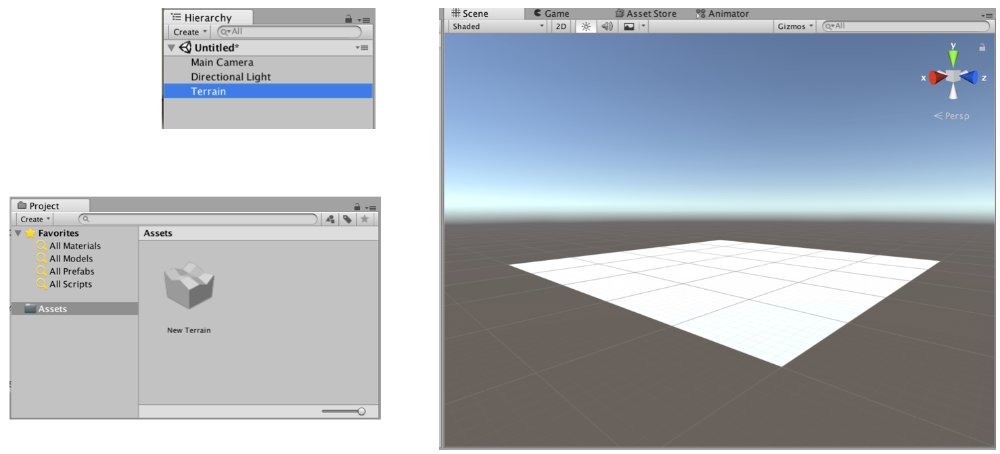
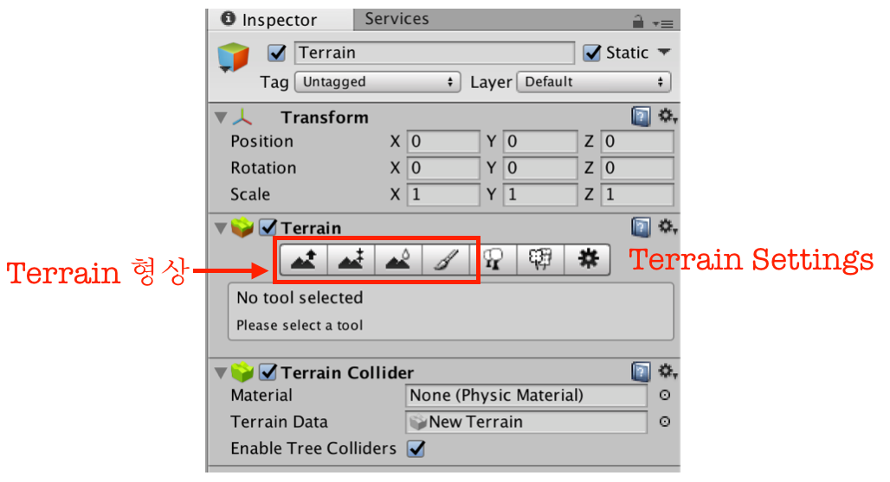
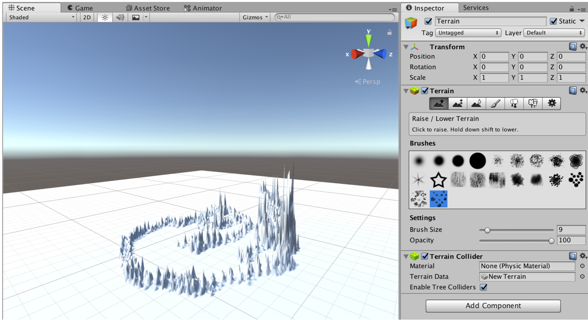

#  3D에 대한 기본적 이해

## Camera

Camera 뷰는 3차원 절단면을 보거나, 2차원 고정체 카메라가 있다.

Camera 뷰의 크기는 Zoom in과 out 이다.

Camera 뷰의 비율은 화면 비율이다.

## 좌표계 coordinate

X축은 수평, Y축은 수직, Z축은 깊이를 나타냅니다. (데카르트 좌표계) ( x, y, z) 의 형식으로 표현합니다.

#### 로컬 공간과 월드 공간

3D 공간에서는 기준점origin 또는 월드 영점이라고 불리는 기준 지점이 있습니다. 이는 (0, 0, 0)의 위치 입니다.

3D 공간에서 오브젝트의 월드상 위치는 이런 기준점 부터의 상대 좌표를 의미합니다.

경우에 따라서는 오브젝트 간의 상대적 위치를 나타내는 로컬 공간을 사용하기도 합니다.

유니티에서는 계층hierarchy패널에서 어떤 오브젝트를 다른 오브젝트로 드래그하여 간단하게 부모자식 관계를 만들수있습니다.

자식은 부모 오브젝트를 기준으로하는 상대 좌표를 사용하게됩니다. 부모 오브젝트의 위치가 (0, 0, 0)이 됩니다.

유니티에서 3D 모델을 읽어 올 때 3D 모델링 툴에서 아트 애셋을 작업할 때 모델이 3D 패키지에서 (0, 0, 0)의 위치에서 작업되었는지를 확인해야합니다.

Local과 Global 전환은 개체를 선택하고 x키를 누른다.

#### 벡터
3D 개발에서는 데카르트 좌표계에서 정의된 3D 벡터vector를 사용합니다.

2D에서와 마찬가지로  방향과 길이를 가진 선으로 볼 수 있습니다.

이는 오브젝트 간의 앵글, 오브젝트의 방향 등을 계산하는 데 꼭 필요합니다.

카메라
화면을 위한 뷰포트로 사용되는 카메라는 3D에서 아주 중요한 요소입니다.

카메라는 오브젝트에 부착될 수도 있으며 하나의 씬에 여러 카메라가 있을 수 있습니다.

프로젝션 모드
카메라의 프로젝션 모드는 카메라가 대상을 3Dperspective로 담느냐, 2Dorthographic로 담느냐를 결정합니다.

일반적으로 카메라는 피라미드 모양의 FOVfield of view인 퍼스펙티브 모드를 사용하고 이는 3D 렌더링을하는 기본모드 입니다.

직육면체 모양의 FOV인 오쏘그래픽 모드는 2D로 렌더링을 하며 2D 게임의 메인 카메라나 HUDheads up display를 렌더링하기 위한 보조 카메라로 사용됩니다.

폴리곤, 에지, 버텍스, 메쉬
버텍스vertex를 이어서 만든 선 에지edge, 에지를 이어 만든 삼각형 폴리곤polygon, 폴리곤이 모여서 만든 메쉬mesh

보여지는 모델 뿐만 아니라 엔진에서는 메쉬를 사용한 메쉬 충돌체를 만들 수 있습니다.

씬에 존재라는 폴리곤이 늘어날수록 더욱 높은 사양을 요구하게 됩니다.

재질, 텍스처, 셰이더
재질material은 모든 3D 프로그램에서 사용하는 공통적 개념으로 3D 모델의 외형을 설정하기위한 수단입니다.

색상 설정과 반사적 표면 등 모든 것을 다루며 셰이더도 사용 가능합니다.

텍스처는 2의 제곱으로 해상도가 조정되며 GUI 관련 텍스처는 자유롭게 사용합니다.

리지드바디 다이나믹스 rigidbody dynamics
유니티는 엔비티아의 PhysX 물리 엔진을 사용합니다.

물리 엔진이 필요한 오브젝트에만 리지드바디 컴포넌트를 추가하여 불필요한 성능 낭비를 막고 질량, 중력, 속도, 마찰 같은 속성을 부여하여 사실적인 움직임을 구현합니다.

충돌collision  감지
오브젝트에 충돌체collider 컴포넌트를 추가하여 다른 충돌체와 충돌을 감지 할 수 있습니다.

충돌체는 프리미티브primitive와 메쉬 충돌체가 있습니다.

프리미티브는 일반적인 박스, 구, 캡슐 등의 기본 도형이며 섬세한 충돌이 아닌, 성능을 생각하는 충돌체이며

메쉬 충돌체는 메쉬 모양을 본따 정밀한 충돌 체크를 하게 해줍니다.

## 지형(Terrain) 생성

메뉴 GameObject -> 3D Object -> Terrain 으로 지형을 생성하면, 길이가 2000, 너비 2000, 높이 600의 비교적 큰 지형이 생성된다. 이 지형은 계층에 *Terrain* 객체 그리고 Project Assets에 추가된다.

{: width="739px"}

그리고 지형의 크기, 그려지는 종류를 조정할 수 있다. Inspector Window의 Painting 종류와 Terring Settings 를 사용한다.

{: width="600px"}

### Terrain Inspector Window

Terrain의 Inspector Window에 있는 툴바로 지형의 형상, 크기 등을 조절하는데 다음 같다:

- 높이 조절: 브러쉬를 사용해 지형의 높낮이를 설정합니다.
- 높이 지정: 브러쉬를 사용해 지정한 높이만큼 지형을 변화시켜줍니다.
- 스무드: 완성된 지형을 부드럽게 다듬어줍니다.
- 텍스처: 텍스처를 등록하고 등록된 텍스처를 브러쉬를 사용해 지형에 색칠합니다.
- 나무: 지형에 심을 나무를 등록하고 브러쉬를 이용해 나무를 지형에 심습니다.
- 디테일: 풀이나 돌 같은 지형지물을 등록하고 지형에 이를 그려줍니다.
- Terraing Settings: 지형 시스템의 각종 환경을 설정합니다.

#### Terrain Settings

그리고 지형의 크기를 수정하려면 Inspector Window에서 Terrain Settings 아이콘을 선택하고 Terrain Width, Length, Height 를 조절하면 된다.

- Terrain Width: 지형의 길이(x축)를 설정합니다.
- Terrain Height: 지형의 높이(y축)를 설정합니다.
- Terrain Length: 지형의 너비(z축)를 설정합니다.
- Heightmap Resolution: 높이맵 이미지의 해상도를 설정, 항상 2의 n승에서 +1을 더한 값을 사용한다( 2, 3, 5, 9, 17, ... )
- Detail Resolution: 디테일(풀, 바위 등)을 표현하는 데 쓰이는 텍스처의 크기를 지정합니다.
- Detail Resolution Per Patch: 디테일 텍스처를 사용하는 구역의 크기를 의미합니다. 숫자가 높을수록 표현하는 정밀도가 떨어지지만 렌더링 부하는 줄어듭니다.
- Control Texture Resolution: 지형에 텍스처를 입힐 때 텍스처 정보를 저장하는 이미지의 해상도를 설정합니다.
- Base Texture Resolution: 지형이 너무 멀리 있거나 하드웨어에서 지형 시스템을 지원하지 않을 경우 이를 대체하는 텍스처 이미지의 크기를 지정합니다.

### 지형 그리기

인스펙트 윈도우에서 Raise/Lower 를 선택하고 아래 Brush에서 적절한 것을 고른후에 씬 뷰의 Terrain 위에 그리면 선택한 브러시 크기, 불투명도에 따라 그려진다.

{: width="600px"}

지형을 낮추려면 Shift키를 누르고 지형 위를 아래로 조절하면 높낮이가 변경된다.

#### 높이지정

테란의 두번째 툴바인 **높이 지정**은 지정한 높이(Height)가 될 때까지 지형을 높여주거나 낮춰줍니다.

#### 스무드

스무드를 선택하고 지형을 드래그하면 부드럽게 조절할 수 있다.

### 텍스처

텍스처를 사용하여 지형의 색을 칠해할 수 있다. 필요한 텍스처는 Unity3D 자체에서 기본적으로 제공된다.  Terrain용 텍스처는 가져와야 하는데 *Assets -> Import Package -> Environment* 에서 Terrain Assets 을 가져온다. 혹은 프로젝트 뷰를 오른쪽 클릭해서 *Import Package -> Terrain Assets* 를 사용해도 된다.

Terrain Inspector Window에서 Terrain Texure를 선택하고 Edit Texutres -> Add Texture로 텍스쳐를 선택한다.

적절한 텍스처를 선택하고 Add Texture를 하면 모든 지형에 자동으로 씌워진다.

{: width="600px"}

이어서 다른 텍스처를 추가하면 더 풍성하게 지형을 Paint brush로 지형을 그려줄 수 있다. 앞서 지정한 텍스처가 전체를 덮고 있어서 Paint Texture 이 Settings에 브러시 크기에 있는 Target Strength 크기를 0보다 크게 입력하고 그려야 한다.

#### Scene 저장

그리고 현재 작업한 것을 Scene으로 저장한다. Cmd+s, Ctrl+s로 또는 File -> Save Scene으로 저장할 수 있다.
Terrain을 scene에 저장하면 Project view의 Terrain 객체 안에 SplatAlpha0라는 스플릿맵이 생성된다. 스플릿맵은 지형에 어떤 텍스처가 입혀졌는지 파악할 수 있다.

## Skybox

스카이박스는 씬을 감싸는 커다란 Up, down, forward, back, left, right 면을 가진 육면체에 미리 준비된 이미지를 붙여 하늘을 표현하는 것으로 이지감 없는 하늘을 표현할 수 있다.

### Skybox 추가하기

Terrain을 선택하고 Component -> Rendering -> Skybox 로 기본 스카이박스를 추가할 수 있다.

http://alolomersedess.tistory.com/entry/Unity3d-50-SkyBox를-적용하는-메뉴-위치가-사라졌네요-Render-Settings

### 스카이박스 만들기

http://alolomersedess.tistory.com/entry/Unity3d-50-SkyBox를-적용하는-메뉴-위치가-사라졌네요-Render-Settings

#### https://docs.unity3d.com/kr/current/Manual/HOWTO-UseSkybox.html
스카이박스의 6면 각각에 대응하는 6개의 텍스처를 만들고 프로젝트의 Assets 폴더에 둔다. 각 텍스처의 Wrap mode를 Repeat에서 Clamp로 변경해야 테두리 색상이 일치한다.

https://docs.unity3d.com/kr/current/uploads/Main/SkyboxWrapmode.png

## 참조
  - [게임배경-3D배경 만들기](http://rgy0409.tistory.com/502)
  - [kurosai Unity3D:지형 설정](http://kurosai.tistory.com/entry/Unity3D-지형-설정)
  - [Sky Box](https://docs.unity3d.com/kr/current/Manual/HOWTO-UseSkybox.html)
