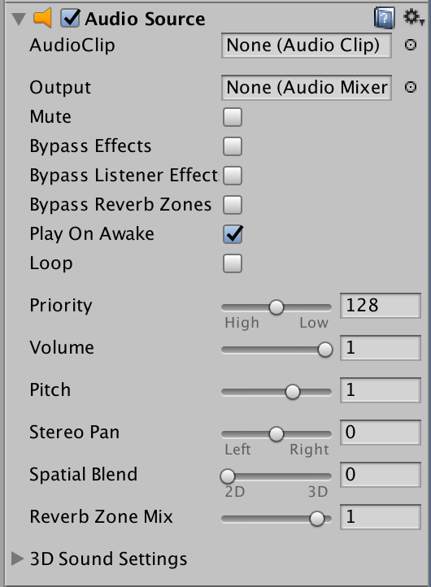

프로젝트 지원 파일 MollyMolly 폴더에 있다.
게임 파일은 MollyMolly/Mole Game 폴더
- [MoleGame]Scripts.unitypackage
- [MoleGame]Sound.unitypackage
- [MoleGame]Texture.unitypackage
- SceneMove.cs


### 시작


#### 게임 만들기

두더쥐 게임은을 만드는 순서는 다음가 같다.

1. 두더쥐 구멍 제작하기
  - 기본 상태 머신 만들기
  - 상태에 따라 각각의 애니메이션 재생하기
  - 상태 변경시 사운드 재생하기
2. InputManager 제작하기
  - 구멍을 터치하면 구멍에 신호
  - 여러개 구멍 만들기
3. GameManager 제작하기
  - 여러개 구멍 관리하기
  - 두더지 터치시 발생하는 점수 곤리하기
  - 게임 매니저로 제한시간 관리하기
  - 제한시간 표기하는 GUI 만들기
4. 결과 화면 만들기
  - 결과 gUI 배치하기
  - 결과창에 점수 표시하기
  - 리플레이


#### 패키지 가져오기

Project view에서 우측 마우스로 Import package > Custom package 를 실행해 *[MoleGame]Sound.unitypackage*, *[MoleGame]Texture.unitypackage* 패키지를 들여온다.

Assets 폴더 밑에 Sounds, Textures 폴더에 들여온 파일이 추가된다.


#### 상태머신

'상태머신'은 스크립트에서 특정 상태를 지속해 번갈아 반복 재생하는 플레이 구조이다.

두더쥐의 상태 머신

1. 아무 것도 없을 때 None 상태의 빈 구멍에서 시작한다.
2. 신호가 오면 상태를 Open 상태로 바꾸고, Open 애니메이션을 실행한다.
3. Open애니메이션이 끝나면 상태를 Idle로 바꾸고, Idle 애니메이션을 실행한다.
4. Open이나 Idel 중 터치가 되면 상태를 Catch로 바꾸고, Catch 애니메이션을 실행한다.
5. Idle 애니메이션이 끝날때까지 터치가 없으면 상태를 Close로 바꾸고, Close 애니메이션을 실행한다.
6. Catch와 Close 애니메이션이 끝나면 None 상태로 간다.
7. None 상태에서 특정 시간이 경과하면 Open상태로 가라는 신호를 준다.


#### Hole.cs


상태를 가진 MoleState.cs 스크립트

```cs
// 5가지 상태
public enum MoleState
{
  None,
  Open,
  Idle,
  Close,
  Catch
}
```

게임 콤포넌튼 Hole.cs

```cs
using UnityEngine;
using System.Collections;

public class Hole: MonoBehavior {

  public MoleState MS;

  void Start() {

  }

  void Update() {

  }
}
```

유니티 에디터에  Quad 오브젝트를 하나 추가한다.
그리고 Hole.cs 를 Quad 오브젝트에 추가하고, Quad 오브젝트의 Hole 스크립트 임포터에서 MS 상태 값을 확인한다.


#### Material 추가

Assets 폴더에 Materials 폴더를 추가해주고, 이곳에 새 머터리얼 Hole을 추가한다. 2D 게임을 위해서 Hole 머터리얼의 쉐이더를 Unlit / Transparency 로 선택한다. 그리고 두더지 이미지를 하나 선택해 준다.

> Unlit은 Un light의 약자로 조명의 영향을 받지 안흔ㄴ다.

#### Camera

Camera의 Projection을 Orthographic 으로, Size 를 1.5배로 변경한다.

#### 스프라이트

Hole.cs 에 스프라이트 이미지를 상태에 따라 담을 코드를 추가한다.


이제 Quad 오브젝트의 Hole.cs 임포터에 공개 변수가 노출된 것을 확인할 수 있다. 각 스프라이트 이미지를 배열에 배치하기 위해서 스프라이트 이미지는 순서가 있게 이름을 주고, Open, Idle, Catch, close 상태에 변수에 드래그 해주면 된다.


#### 상태머신에 따라 애니메이션

상태머신의 상태에 따라 한장씩 이미지를 애니메이션.
 - Open_On() : 애니메이션 시작
 - Open_Ing(): 한장씩 넘기는 함수. Update() 에서

```cs

  void Update() {
    if( MS == MoleState.Open ) {
      Open_Ing();
    }
    if( MS == MoleState.Idle ) {
      Idle_Ing();
    }
    if( MS == MoleState.Close ) {
      Close_Ing();
    }
    if( MS == MoleState.Catch ) {
      Catch_Ing();
    }
  }
```


각 상태의 이벤트 함수는

```cs

  public void Open_On() {
    // 상태를 Open으로 한다.
    MS = MoleState.Open;
    Ani_count = 0;
  }

  public void Open_Ing() {
    // 애니메이션을 한장씩 넘긴다.
    GetComponent<Renderer>().material.mainTexture = Open_Images[Ani_count];
    Ani_count += 1;

    if( Ani_count >= Open_Images.Length ) {
      // end Open animation
      Idle_On();
    }
  }

  public void Idle_On() {
    MS = MoleState.Idle;
    Ani_count = 0;
  }

  public void Idle_Ing() {
    // 애니메이션을 한장씩 넘긴다.
    GetComponent<Renderer>().material.mainTexture = Idle_Images[Ani_count];
    Ani_count += 1;

    if( Ani_count >= Idle_Images.Length ) {
      // end Open animation
      Close_On();
    }
  }

  public void Close_On() {
    MS = MoleState.Close;
    Ani_count = 0;
  }

  public void Close_Ing() {
    // 애니메이션을 한장씩 넘긴다.
    GetComponent<Renderer>().material.mainTexture = Close_Images[Ani_count];
    Ani_count += 1;

    if( Ani_count >= Close_Images.Length ) {
      // end Open animation
      MS = MoleState.None;
      Ani_count = 0;
    }
  }


  public void Catch_On() {
    MS = MoleState.Catch;
    Ani_count = 0;
  }

  public void Catch_Ing() {
    // 애니메이션을 한장씩 넘긴다.
    GetComponent<Renderer>().material.mainTexture = Catch_Images[Ani_count];
    Ani_count += 1;

    if( Ani_count >= Catch_Images.Length ) {
      // end Open animation
      MS = MoleState.None;
      Ani_count = 0;
    }
  }
```

renderer.material.mainTexture 는 이 오브젝트가 가진 머터리얼의 메인텍스쳐.

이제 Quad 인스펙터에서 Hole.cs 임포터의 MS 를 변경한 후에 재생을 하면 애니메이션이 실행되는 것을 혹인할 수 있다.

- GetComponent <AudioSource>() :  AudioSource안에 있는 컴포넌트를 받아옵니다.


#### 자동으로 Open 되게 하기

  // 시간 지연

```cs
public IEnumerator Wait() {
  float wait_Time = Random.Range(0.5f, 4.5f); 
  yield return new WaitForSeconds(wait_Time);// 시간만큼 대기
  Open_On();
}
```

Wait() 함수는 `StartCoroutine()` 함수를 통해 실행된다.

Close_int, Catch_Ing() 에서 다음을 삭제하고 StartCoroutine('Wait') 구문을 추가해 준다.

이제 Hole.cs 인스펙터에서 MS의 상태를 Close로 두고 재생해 보면 두더쥐가 사라지고, 일정 시간후에 나타나는 애니메이션이 반복된다.

그리고 Hole.cs 인스펙터에서 Ani_Speed 값을 변경하면 프레임 레이트를 조절할 수 있다.

##### `yield` 구문

서브루틴 함수 등에서 ...


### 두더쥐 잡기

Open > Idle > Close > None > Open 상태에서 두더지를 잡는 Catch 상태는 Catch_On() 함수로 구현하자. Catch는 클릭 혹은 터치가 발생하면 나타낸다.

#### 마우스 클릭

마우스 클릭을 하면 캐치 애니메이션을 실행한다.

```cs
  public void OnMouseDown() {
    // 두더쥐가 Idle, Open 상태인 경우에만
    if( MS == MoleState.Open || MS == MoleState.Idle ) {
      Catch_On();
    }
  }
```


Quad 를 복제해 씬 곳곳에 배치한다. 실행해서 각 두더쥐가 Catch 되는지 확인한다.

잘 동작하면 원래 Quad 만 남기고 모두 지운다.


#### SoundManager class 사용하기

http://noviacommunity.tistory.com/entry/Unity-폭발-사운드-입히기


#### 사운드 효과

Quad 오브젝트 를 선택하고 Component > Audio > Audio Source 콤포넌트를 붙여 준다.



이 Audio source 콤포넌트를 소스에서 편집해서 사용할 수 있다.

공개변수로 Audio_Clip 변수 두 개를 선택해 준다.

```cs
// 효과음
AudioSource playerSound;
public AudioClip Open_Sound;
public AudioClip Catch_Sound;
```

오디오 장치를 초기화 한다.

```cs
void Start() {
  playerSound = GetComponent<AudioSource>();
}
```

Open, Catch 상태일 때 사운드를 켜려면 Open_On(), Catch_On() 함수에서 사운드를 AudioSource에 연결해 실행하면 도니다.


```cs
  public void Open_On() {
    MS = MoleState.Open;
    Ani_count = 0;
    playerSound.clip = Open_Sound;
    playerSound.Play();
  }
  public void Catch_On() {
    MS = MoleState.Catch;
    Ani_count = 0;
    // Play sound
    playerSound.clip = Catch_Sound;
    playerSound.Play();
  }
```


## 참조

- [C# 키워드](https://docs.microsoft.com/ko-kr/dotnet/csharp/language-reference/keywords/index)
